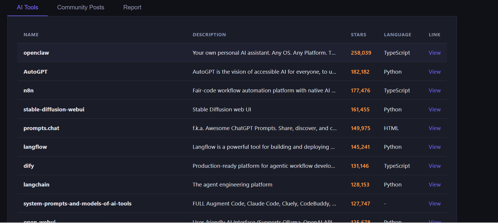
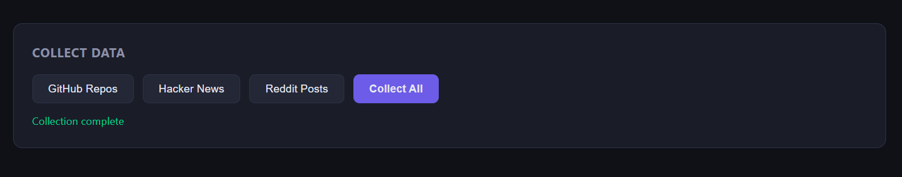
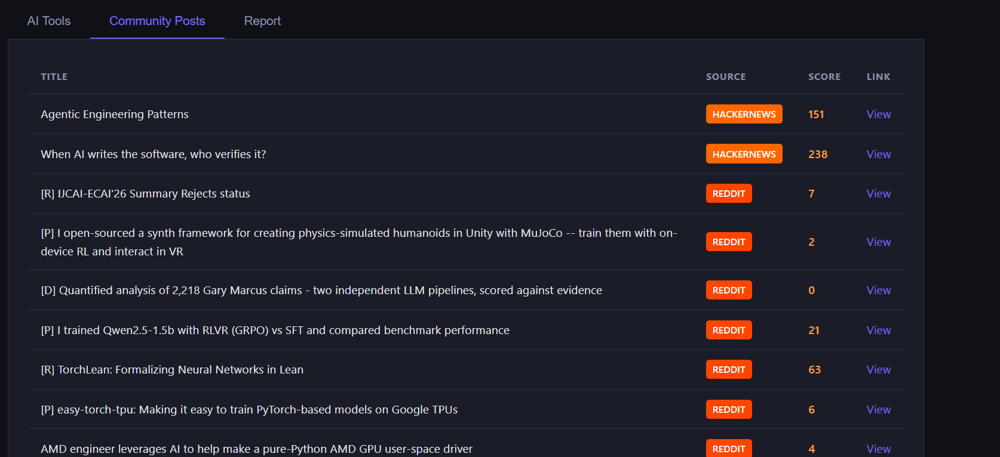
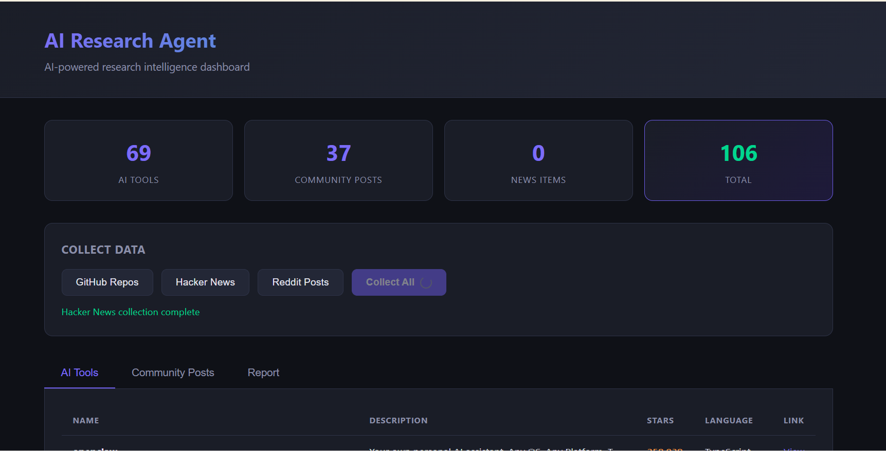
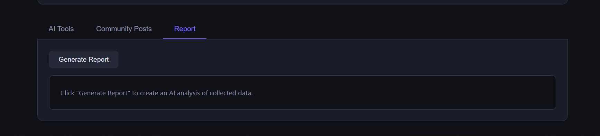

# 🔬 AI Research Agent

An AI-powered research intelligence system that **collects, analyzes, and reports** on trending tech topics from sources like GitHub, Hacker News, and Reddit — then summarizes findings using AI and can deliver reports via email.

## ✨ Features

- 🛰️ **Collectors** — pull trending data from GitHub, Hacker News, and Reddit
- 🧠 **Analyzer** — AI-driven analysis of collected research data (OpenAI / Gemini / OpenRouter)
- 🗄️ **Database** — persistent storage via SQLModel + SQLite
- 📊 **Report Builder** — compiles findings into structured reports
- 📧 **Email module** — for sending out generated reports
- ⚡ **FastAPI backend** — exposes the system as an API
- ⏰ **Scheduler** — for automating periodic data collection

## 📁 Project Structure

```
.
├── backend/            # FastAPI app + config
├── collectors/         # GitHub / Hacker News / Reddit collectors
├── analysis/           # Research analyzer
├── database/           # Models, CRUD, DB connection (SQLModel)
├── reports/            # Report generation
├── email/              # Email sending utilities
├── scheduler/          # Scheduled jobs
└── test_*.py           # Test scripts for each module
```

## 🛠️ Setup

1. **Clone the repo**
   ```bash
   git clone https://github.com/IbrahimPopatiya/ai_research_agent.git
   cd ai_research_agent
   ```

2. **Create a virtual environment**
   ```bash
   python -m venv .venv
   .venv\Scripts\activate      # Windows
   source .venv/bin/activate   # macOS/Linux
   ```

3. **Install dependencies**
   ```bash
   pip install fastapi uvicorn sqlmodel python-dotenv openai httpx
   ```

4. **Configure environment variables**

   Create a `.env` file in the project root (this file is git-ignored and must never be committed):
   ```env
   OPENAI_API_KEY=your_openai_api_key
   GEMINI_API_KEY=your_gemini_api_key
   OPENROUTER_API_KEY=your_openrouter_api_key
   DATABASE_URL=sqlite:///./ai_research.db
   EMAIL_USER=your_email@gmail.com
   EMAIL_PASSWORD=your_email_password
   ```

## 🚀 Running the App

Start the FastAPI backend:
```bash
uvicorn backend.main:app --reload
```

The API will be available at `http://127.0.0.1:8000`.

### Running individual collectors / tests
```bash
python test_github_collector.py
python test_hn_collector.py
python test_reddit_collector.py
python test_analyzer.py
python test_report.py
```

## 🔐 Security Note

This project uses a `.env` file for API keys and credentials. **Never commit your `.env` file** — it is already excluded via `.gitignore`.

## 🖼️ Screenshots

### AI Tools List


### Collection


### Community Posts


### Data


### Reports


---

## 📄 License

This project is for personal/educational use.
